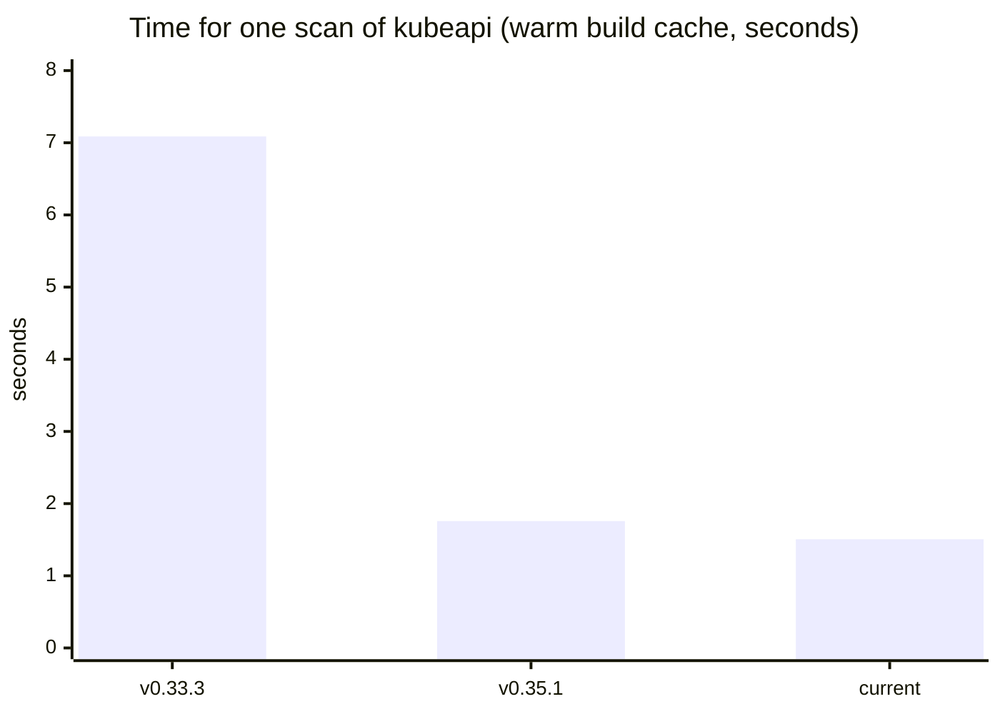
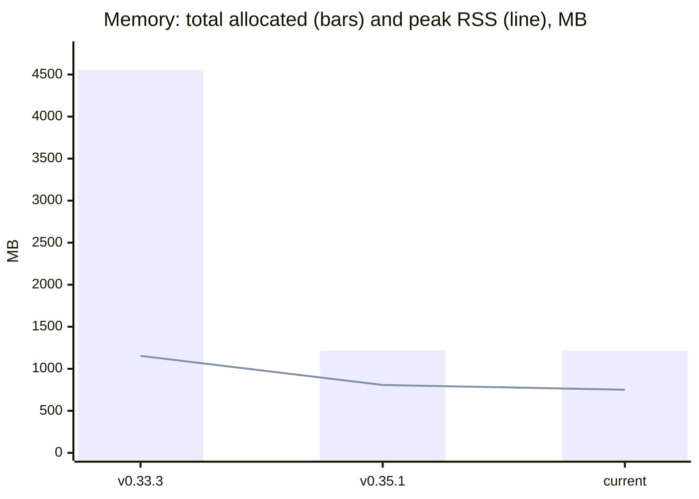
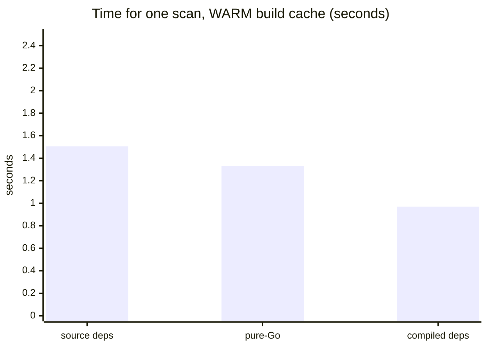
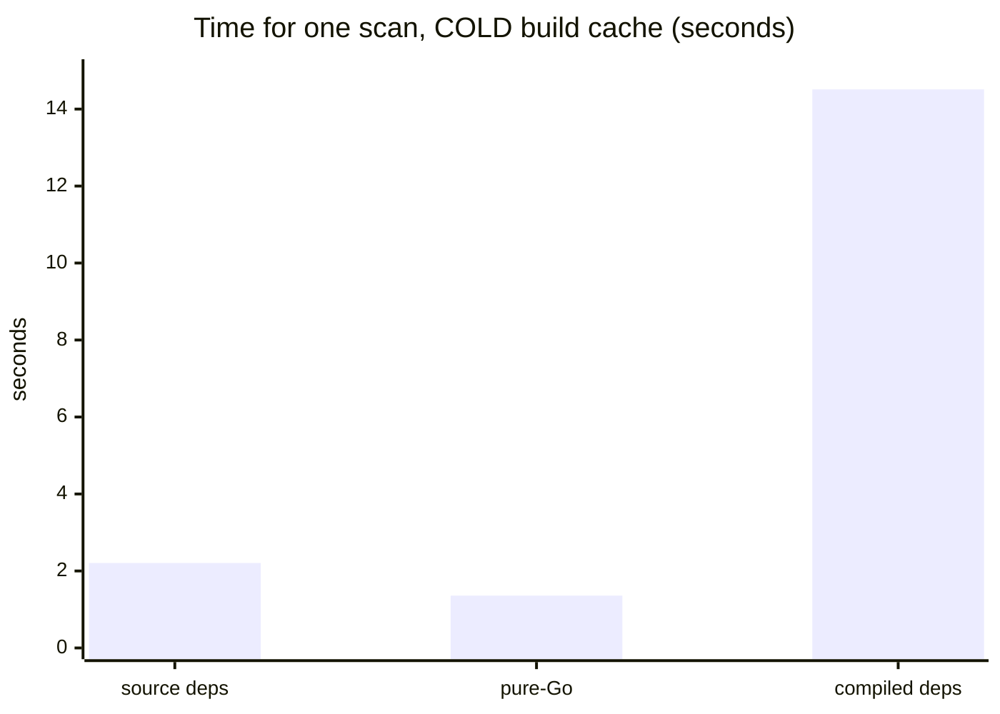
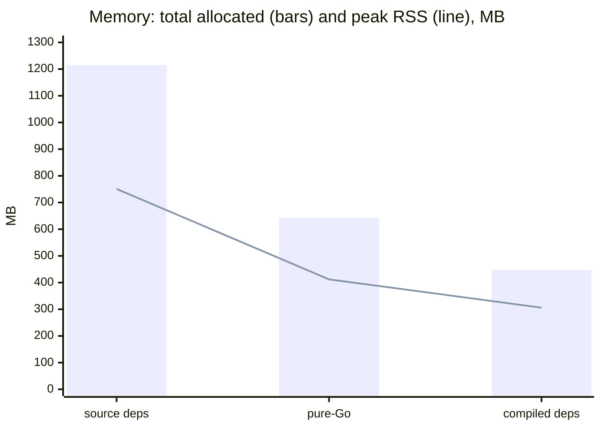

codescan was extracted from [go-swagger](https://github.com/go-swagger/go-swagger)
and has been reworked twice since, in ways that turned out to matter for what a
scan costs. This page is the short version of the evidence: three points in time,
then the loader options available today, measured on one corpus.

The full method, both corpora and the raw tables live in
[`internal/benchmarks`](https://github.com/go-openapi/codescan/tree/master/internal/benchmarks).

## The corpus

Everything below scans **kubeapi**: an API *server stub* that go-swagger generates
from the kubernetes API manifest — not kubernetes itself, and not code that ever
runs. It is here because of its shape: 2352 Go files, ~344k lines, and an
annotated surface of 222 model definitions and **260 route/operation blocks**,
which is as much work as an annotation parser is ever asked to do.

Every figure on this page comes from a scan that emitted the **same 222
definitions and 260 paths**. A configuration that got faster by scanning less
would not be an improvement, so the emitted document is checked alongside the
cost.

## Three points in time

{}
**v0.33.3** is roughly the state the code was extracted from go-swagger in.
**v0.35.1** is the first debugged release of the grammar-based annotation parser.
**current** is master in its default configuration.
{}

End to end, out of the box: **4.7× faster and 3.7× less allocated**, for the
identical document. Either of the loader options in the next section takes it
further — compiled dependencies reach 0.970 s and 447 MB, which is **7.3× faster
and 10× less allocated** than v0.33.3.

All three bars are the *same* configuration, so the series measures six months of
work and nothing else. That matters because the largest single step available
today is not on this chart at all: it is a flag, and mixing it in here would
credit the calendar for it.

The two charts do not tell the same story, and the difference is the interesting
part. The step from v0.33.3 to v0.35.1 removes 3.3 GB of *allocation* but only
346 MB of *peak* — the old regexp-based parser allocated and discarded, so the
high-water mark stayed near the floor that the loaded package graph sets. Nothing
since has moved that floor by default (−56 MB). Asking for a different loader
moves it, and is worth −395 to −501 MB.

### What each step changed

**v0.33.3 → v0.35.1 — the annotation parser.** The
[grammar]({}) replaced a regexp engine. That was a
correctness, diagnostics and completeness project, not a performance one, and the
speed is a byproduct of dropping Go's `regexp` from the hot path. It is worth
knowing how large the byproduct is on route-heavy code: scanning only this
corpus's models — nothing to emit — the two versions allocate the same to within
0.5 MB, while scanning the routes goes from 4476 MB to 1216 MB. The whole gain is
in reading annotations, and it appears where route and operation bodies do.

**v0.35.1 → current — the package loader.** Resolving and type-checking the
package graph is the bulk of a scan, and it is now possible to ask for a loader
that reads less of it. In the default configuration this stretch bought speed
only — a quarter-second on both corpora, allocation-neutral to within 2 MB. The
memory is all in the asking. That is the next section.

## How each loader option fares

Three ways to get the package graph, all producing the same document. They
differ in what they read and what they hold.

Note the axes: the two charts below are the *same* three configurations, timed on
a warm build cache and on an empty one. Only the scale differs — and it differs
by an order of magnitude.

| configuration | option | warm | cold | allocated | peak RSS | build cache it writes |
|---|---|---|---|---|---|---|
| source dependencies | *the default* | 1.506 s | 2.208 s | 1215 MB | 751 MB | 7.7 MB |
| pure-Go loader | `ToolchainFreeLoader` | 1.331 s | **1.359 s** | 643 MB | 412 MB | **4 KB** |
| compiled dependencies | `CompiledDependencies` | **0.970 s** | 14.511 s | **447 MB** | **306 MB** | 231 MB |

**No configuration wins both cache states**, which is the whole reason there is a
choice to make:

- **Compiled dependencies** take dependency types from the compiler instead of
  reading their source — 31 packages read from source rather than 296. Fastest and
  smallest by a wide margin on a warm cache. On a cold one it must *compile* the
  closure before it can read it, so it is more than 6× slower than reading
  source, and it writes 231 MB of build cache. Opt in where the cache is warm by
  construction; it is off by default because a CI job regenerating a spec from a
  clean checkout is not.
- **The pure-Go loader** never invokes the go command, so there is no metadata to
  populate and nothing to compile: it writes 4 KB of build cache and **its cold
  time equals its warm time**. It is the only choice whose cost is predictable,
  and it holds about 45% less memory than the standard loader.

Which to reach for, and what each one gives up, is on the
[Options reference]({}).

## Reading these numbers

They are indicative, not a promise. Measured on one machine (Ryzen 7 5800X,
31 GB, go1.26.5, Linux), three warm rounds and a single cold one — cold being a
single-shot state by definition.

Two cautions carry over to any corpus of your own:

- **The two gains scale with different things.** The loader acts on the
  *dependency closure*, so its win is roughly a fixed amount per project; the
  parser acts on the *annotated surface*, so its win is large on a route-heavy
  server and small on a client carrying annotations only on its models. On a
  smaller tree the loader's share of the total looks much bigger than it does
  here.
- **Wall clock needs an idle machine.** Under load these timings move by 3× while
  the allocation and peak-RSS figures reproduce to four digits. Distrust a timing
  difference under 10%; nothing concluded above rests on one.

To measure your own tree, the harness takes it as an extra corpus alongside the
two it ships with — see its
[README](https://github.com/go-openapi/codescan/tree/master/internal/benchmarks).
